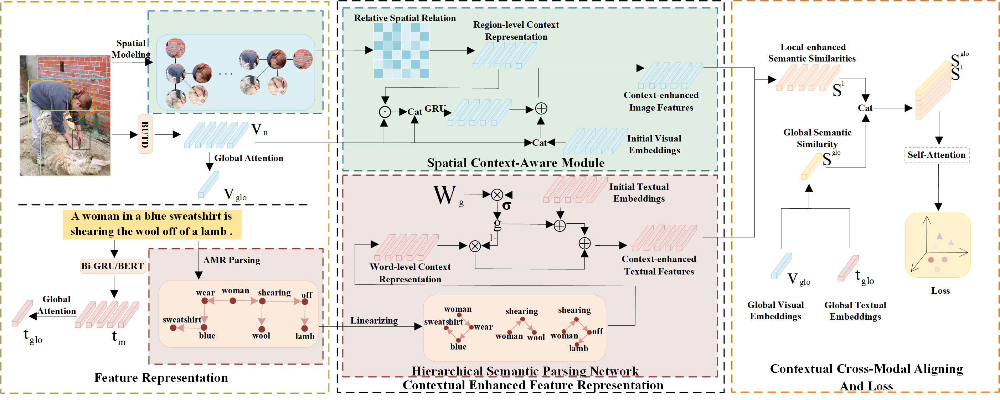

# Enhancing Image-Text Matching through Contextual Fine-Grained Alignment

## Introduction

**The framework of CEFG:**



## Requirements and Installation
- Python 3.8  
- [PyTorch 1.11.0](https://pytorch.org/)  
- Transformers 4.18.0  
- See [requirements.txt](./requirements.txt) for the full environment setup

## Results
**Results on Flickr30K Test Split**
<table>
   <tr> <td rowspan="2">     </td> <td rowspan="2", align="center">Visual Backbone</td>  <td rowspan="2", align="center">Text Backbone</td>
        <td colspan="3", align="center">Sentence retrievaltd</td> <td colspan="3", align="center">Image retrieval</td> </tr>
   <tr> <td>R@1</td><td>R@5</td><td>R@10</td> <td>R@1</td><td>R@5</td><td>R@10</td> </tr>
    <tr> <td>CEFG</td> <td align="center">BUTD region</td> <td align="center">GRU-base</td> <td>78.7</td><td>95.5</td><td>97.9</td> <td>61.6</td><td>85.5</td><td>90.6</td> </tr>
   <tr> <td>CEFG</td> <td align="center">BUTD region</td> <td align="center">BERT-base</td> <td>81.7</td><td>95.6</td><td>98.0</td> <td>65.2</td> <td>88.4</td><td>93.3</td> </tr><table>
   
   
 **Results on COCO 5-fold 1K Test Split**
<table>
   <tr> 
	<td rowspan="2">     </td>
	<td rowspan="2", align="center">Visual Backbone</td>  
	<td rowspan="2", align="center">Text Backbone</td>
        <td colspan="3", align="center">Sentence retrievaltd</td> 
	<td colspan="3", align="center">Image retrieval</td> </tr>
   <tr> 
	<td>R@1</td>
	<td>R@5</td>
	<td>R@10</td>
 	<td>R@1</td>
	<td>R@5</td>
	<td>R@10</td>
 </tr>
 <tr> 
	<td>CEFG</td> 
	<tdalign="center">BUTD region</td>
	 <tdtdalign="center">GRU-base</td> 
	<td>79.2</td>
	<td>97.1</td>
	<td>99.1</td>
 	<td>63.7</td>
	<td>91.0</td>
	<td>96.3</td>
 </tr>
   <tr> 
	<td>CEFG</td> 
	<td align="center">BUTD region</td>
 	<td align="center">BERT-base</td> 
	<td>81.8</td>
	<td>97.2</td>
	<td>99.2</td> 
	<td>66.5</td> 
	<td>92.1</td>
	<td>97.4</td>
 </tr>
<table>

## Download data and vocab
We follow [SCAN](https://github.com/kuanghuei/SCAN) to obtain image features and vocabularies, which can be downloaded by using:

```bash
https://www.kaggle.com/datasets/kuanghueilee/scan-features
```
Another download link is available below：

```bash
https://drive.google.com/drive/u/0/folders/1os1Kr7HeTbh8FajBNegW8rjJf6GIhFqC
```

## Training
 
```bash
python train.py
```
##Evaluation

```bash
python evaluation.py
```


